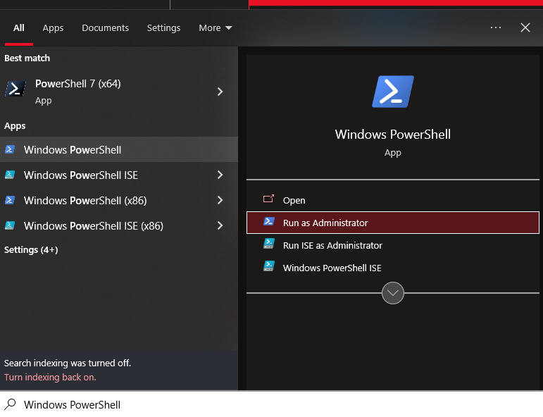

# [NOT WORKING ANYMORE!!] Country Flag Emojis for Windows

IMPORTANT: The September 2023 update for Windows 10 & 11 seems to have broken the font, making all emojis invisible. To revert to the original Windows emojis, just restore the seguiemj.ttf file (by dragging it to the Windows fonts folder or double-clicking it and pressing "Install") and restart your PC.

Original description:

Get country flags like 🇺🇸 🇬🇧 🇪🇸 🇲🇽 🇵🇹 🇧🇷 🇫🇷 🇩🇪 🇯🇵 🇨🇳 🇰🇷 🇮🇳 to display properly on windows instead of just seeing placeholders like `US`, `GB`, `ES`!

The file [google_emoji_font_for_windows.ttf](https://github.com/perguto/Country-Flag-Emojis-for-Windows/blob/master/google_emoji_font_for_windows.ttf?raw=true) is all you need.
Installing it overwrites the Windows Emoji font and replaces it with Google's Emoji font (the same one as on Android), which has all country flags and looks better anyway.
(Make a copy of the original Windows emoji font [`C:\Windows\Fonts\seguiemj.ttf`](C:\Windows\Fonts\seguiemj.ttf), so you can always revert.)

Restart your computer to make the new font appear everywhere!

## Detailed Instructions

(This is just the same steps as described above, but in more detail)

Video tutorial: https://youtu.be/jrs3Y7SIQL0

1. Open the windows fonts folder by typing `C:\Windows\Fonts` into the explorer address bar. Find the font `Segoe UI Emoji Regular` copy it and save it as a backup in a different folder.


2. [Click here to download `google_emoji_font_for_windows.ttf`](https://github.com/perguto/Country-Flag-Emojis-for-Windows/blob/master/google_emoji_font_for_windows.ttf?raw=true).

3. Open in another window the folder where you saved `google_emoji_font_for_windows.ttf` and drag it into the font folder.

<p float="left">

&nbsp; &nbsp; &nbsp; &nbsp;

</p>

4. You're asked if you want to replace the Segoe UI Emoji font. Choose yes.


5. You're done! Restart your computer to make the new emojis appear.

## Troubleshooting

### New emojis only not showing in browser

Make sure, you don't simultaneously use other browser extensions for Emojis or different fonts. Also note that some sites load their own emoji fonts and might therefore not work.

Alternatively, if you only want flags in your browser, get the tampermonkey chrome extension (greasemonkey for firefox) and install this script: [https://perguto.github.io/tampermonkey/Country%20Emojis.user.js](https://perguto.github.io/tampermonkey/Country%20Emojis.user.js)

### New emojis not showing at all

In case you still see the old emojis after a restart, you can try clearing the font cache. That is, open powershell as administrator:



Then, paste

```
cd 'C:\Windows\ServiceProfiles\LocalService\AppData\Local'
mv "FontCache" "FontCache_backup"
```

(`CTRL-V` might not work, press the right mouse button). (Afterwards, you can remove the backup with

```
cd 'C:\Windows\ServiceProfiles\LocalService\AppData\Local'
rm "FontCache_backup"
```
or restore it with

```
cd 'C:\Windows\ServiceProfiles\LocalService\AppData\Local'
mv -force "FontCache_backup" "FontCache"
```
)

## How I did it

Google's Emoji Font
[Noto Color Emoji](https://fonts.google.com/download?family=Noto%20Color%20Emoji) is free for anyone to download and modify. For Windows, you need their converted version [Noto Color Emoji WindowsCompatible](./resources/NotoColorEmoji_WindowsCompatible.ttf) as the original font uses Google's own extension of the ttf font format for colors, which differs from Microsoft's.

All I did was changing the font names to that of Microsoft's emoji font "Segoe UI Emoji"

I did this with `ttx`, a program belonging to the fonttools suite.

`ttx` is part of the `fonttools` python package.

Download `python`, its package manager `pip`, put them in your PATH and enter

```sh
pip install fonttools
```

now by using
```
ttx somefontfile.ttf
```

you get an xml file `somefontfile.ttx`, which you can open with a text editor and edit, the files are rather self-explanatory.

I just replaced the whole `<name>...</name>` block of Google's `NotoColorEmoji_WindowsCompatible.ttf` font with that of Microsoft's `seguiemj.ttf` font.

Finally, convert back with
```
ttx somefontfile.ttx
```

and you'll get a file `somefontfile.ttf` (or `somefontfile#1.ttf` if that file already exists) which you can install right away.


## Other Emoji Fonts
<!-- https://fonts.google.com/download?family=Noto%20Color%20Emoji -->
Apparently, it's also possible to get Twitter's emojis on Windows:

[https://github.com/13rac1/twemoji-color-font#install-on-windows](https://github.com/13rac1/twemoji-color-font#install-on-windows) 
