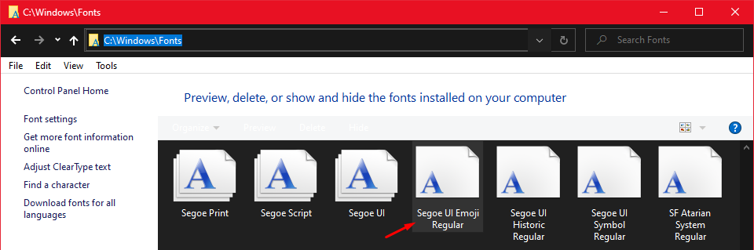
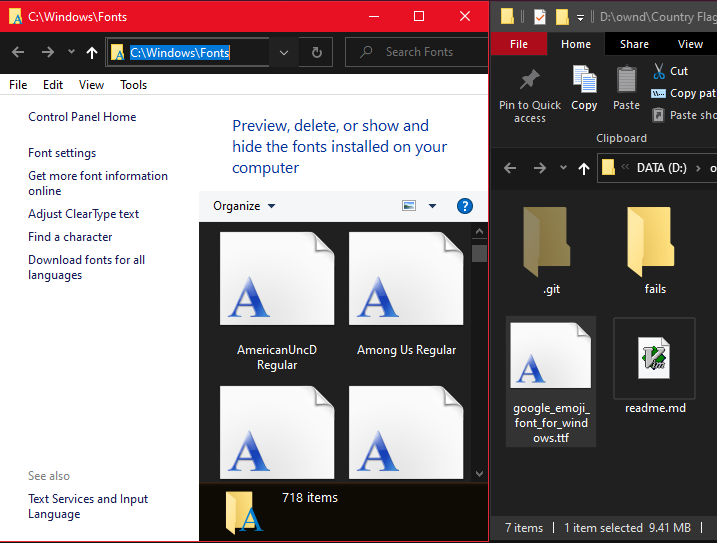
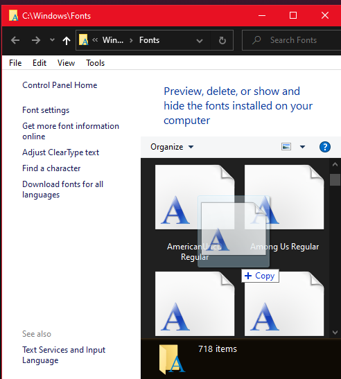
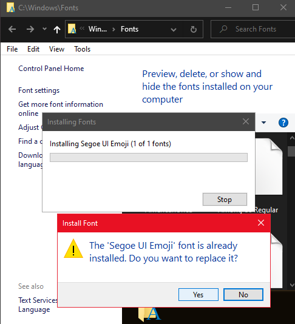

# Country Flag Emojis for Windows

Get country flags like 🇺🇸 🇬🇧 🇪🇸 🇲🇽 🇵🇹 🇧🇷 🇫🇷 🇩🇪 🇯🇵 🇨🇳 🇰🇷 🇮🇳 to display properly on windows instead of just seeing placeholders like `US`, `GB`, `ES`!

The file [google_emoji_font_for_windows.ttf](https://github.com/perguto/Country-Flag-Emojis-for-Windows/blob/master/google_emoji_font_for_windows.ttf?raw=true) is all you need.
Installing it overwrites the Windows Emoji font and replaces it with Google's Emoji font (the same one as on Android), which has all country flags and looks better anyway.
(Make a copy of the original Windows emoji font [`C:\Windows\Fonts\seguiemj.ttf`](C:\Windows\Fonts\seguiemj.ttf), so you can always revert.)

Restart your computer

## Detailed Instructions

(This is just the same steps as described above, but in more detail)

1. Open the windows fonts folder by typing `C:\Windows\Fonts` into the explorer address bar. Find the font `Segoe UI Emoji Regular` copy it and save it as a backup in a different folder.

2. [Click here to download `google_emoji_font_for_windows.ttf`](https://github.com/perguto/Country-Flag-Emojis-for-Windows/blob/master/google_emoji_font_for_windows.ttf?raw=true).

3. Open in another window the folder where you saved `google_emoji_font_for_windows.ttf` and drag it into the font folder.

&nbsp; &nbsp; &nbsp; &nbsp;

4. You're asked if you want to replace the Segoe UI Emoji font. Choose yes.

5. You're done! Restart your computer to make the new emojis appear.
